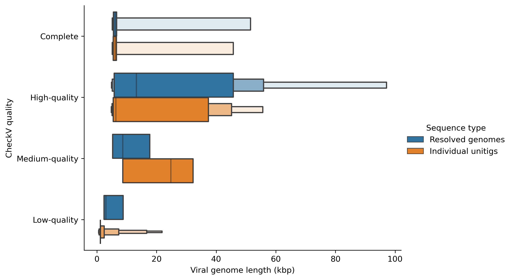
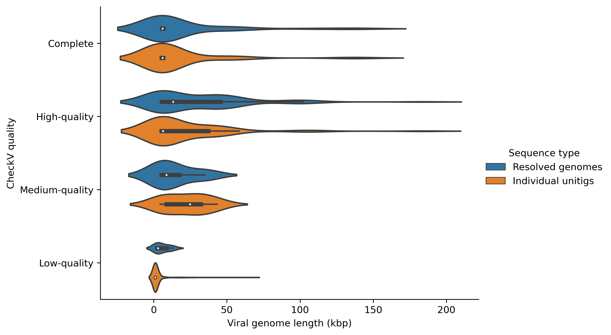

# Comparing the viral quality of resolved genomes and their constituent unitigs

You can combine the resolved genomes (`resolved_paths.fasta`) and their constituent unitigs (`resolved_edges.fasta`), and compare the viral quality.

## Run CheckV

You can combine the resolved genome sequences and unitig sequences and run CheckV as follows.

```bash
# Combine resolved_paths.fasta and resolved_edges.fasta
cat resolved_paths.fasta resolved_edges.fasta > all_sequences.fasta

# Run CheckV
checkv end_to_end all_sequences.fasta checkv_result
```

Now you can compare and visualise the quality of the resolved genomes and their constituent unitigs. The following example code shows how to visualise the results using Python.

## Importing Python packages

Assuming you have installed Python and the packages `matplotlib`, `pandas` and `seaborn`, let's import the following.

```python
import pandas as pd
import seaborn as sns
import matplotlib.pyplot as plt
```

## Load the data

Now we will load the `quality_summary.tsv` file into a dataframe called `checkv_res`.

```python
# Load the quality_summary.tsv from the CheckV results
checkv_res = pd.read_csv(project_path+"checkv_result/quality_summary.tsv", delimiter="\t", header=0)
```

## Format the data

Now we will convert the sequence lengths into kilobases by dividing the lengths by 1000.

```python
# Format the genome length to kb
checkv_res['contig_length'] = checkv_res['contig_length'].div(1000)
```

Then we will add a new column to our dataframe called `Sequence type` to denote whether the sequence is a resolved genome or a unitig.

```python
# Add a new column as "Sequence type"
seq_type = []

for index, row in checkv_res.iterrows():
    if row['contig_id'].startswith("phage"):
        seq_type.append("Resolved genomes")
    else:
        seq_type.append("Individual unitigs")

checkv_res.insert(2, "Sequence type", seq_type, True)
```

## Plot the data

Now we can plot the viral quality (`Complete`, `High-quality`, `Medium-quality` or `Low-quality`) of the resolved genomes and their constituent unitigs using boxen plots and the save the figure as follows.

```python
# Set the order of viral quality
myorder=["Complete", "High-quality", "Medium-quality", "Low-quality"]

# Plot using catplot
ax = sns.catplot(y="checkv_quality", x="contig_length", hue="Sequence type", kind="boxen", data=checkv_res, height=5, aspect=1.5, order=myorder, showfliers=False)

# Set axis titles
ax.set(xlabel='Viral genome length (kbp)', ylabel='CheckV quality')

# Save figure
plt.savefig("checkv_qual_boxen.pdf", dpi=300, bbox_inches='tight', format='pdf') 
```




You can change the `kind` of the plot as you wish. For example, you can draw a violin plot by changing `kind="violin"` as follows.

```python
ax = sns.catplot(y="checkv_quality", x="contig_length", hue="Sequence type", kind="violin", data=checkv_res, height=5, aspect=1.5, order=myorder, showfliers=False)
```

